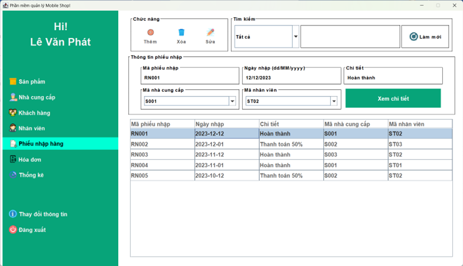

# **MOBILE SHOP**
Đề tài môn Cơ sở dữ liệu sử dụng **Java Swing + MYSQL + JDBC**
> Colabrator: Thanh Duy
- Mọi vấn đề xin liên hệ: [Facebook Lê Văn Phát](https://www.facebook.com/vanphatit/ "Facebook Lê Văn Phát")

------------


### 1. Database
- MySQL Workbench
- Chạy script tạo database ở **backup/mobile_shop_mysql.sql**
- Import data từ **backup/data**
- Username: **ST01**	Password: **ADMIN**


------------


### 2. Code
- Import 3 library sau: **miglayout-4.0.jar , mysql-connector-j-8.2.0.jar và TimingFramework-0.55.jar** [3 libraries cần thiết](https://1drv.ms/f/s!AqE0CRNksyQbj4UOt-DwLLWa3zS2xw?e=adWfc5 "3 libraries cần thiết")
- Sửa connection trong **src/mobileshop/db/JDBCUtil.java**
```java
public static Connection getConnection() {
        Connection connection = null;
        final String url = "jdbc:mysql://localhost:3306/mobile_shop";
        final String user = "root";
        final String password = "<Chỗ cần sửa, là pass của server>";
        try {
            Class.forName("com.mysql.jdbc.Driver"); // load driver
            connection = DriverManager.getConnection(url, user, password);
        } catch (SQLException e) {
            JOptionPane.showMessageDialog(null, "Cannot connect the database!", "Error", JOptionPane.ERROR_MESSAGE);
        } catch (ClassNotFoundException e) {
            JOptionPane.showMessageDialog(null, "Cannot find the jdbc driver!", "Error", JOptionPane.ERROR_MESSAGE);
        }
        return connection;
    }
```
> Project không build được trên Intelij Idea thì cài plugins **Ant** vào rồi add **build.xml** vào là build được

--------------


### 3. Giao diện





